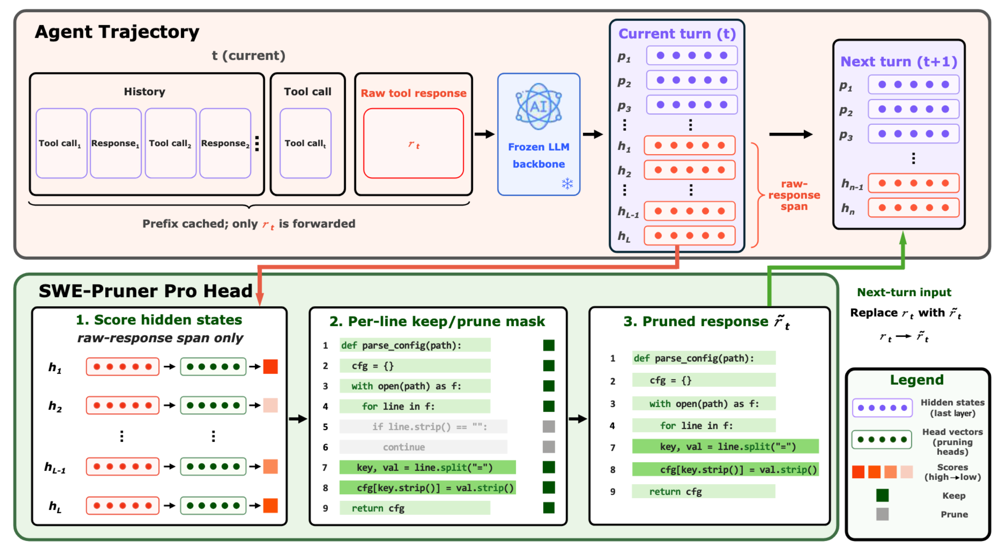
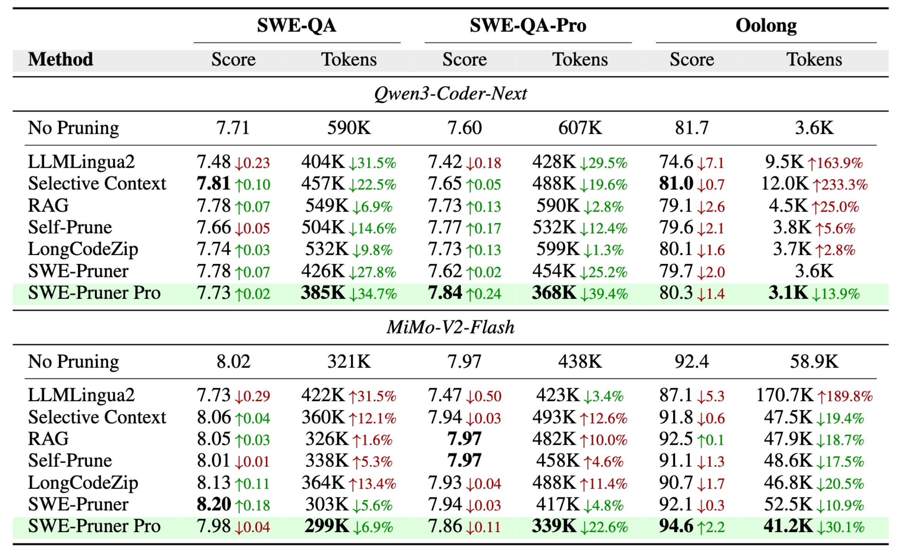

# SWE-Pruner Pro: The Coder LLM Already Knows What to Prune

<p align="center">
  <a href="https://github.com/Ayanami1314/swe-pruner-pro"></a>
  <a href="https://github.com/Ayanami1314/swe-pruner-pro"></a>
  <a href="https://huggingface.co/ayanami-kitasan/swe-pruner-pro-qwen3-coder-next-head"></a>
  <a href="https://huggingface.co/datasets/ayanami-kitasan/swe-pruner-pro-training-corpus"></a>
  
  
</p>

<p align="center">
  <a href="#news">News</a> |
  <a href="#overview">Overview</a> |
  <a href="#results">Results</a> |
  <a href="#quick-start">Quick Start</a> |
  <a href="#reproduction">Reproduction</a> |
  <a href="#repository-layout">Repository Layout</a> |
  <a href="#citation">Citation</a>
</p>

SWE-Pruner Pro is a lightweight in-agent context pruner for long-horizon coding agents. Instead of
asking a separate scoring model to compress tool outputs, SWE-Pruner Pro reads the keep-or-prune
signal directly from the coding agent's own hidden states. A small pruning head attaches to the
frozen backbone, predicts line-level masks for each tool response, and replaces the raw response
with a compact skeleton in the next turn.

<p align="center">
  
</p>

## News

- **2026-07-22**: We release the pruning head weights and training corpus on Hugging Face: [Qwen3-Coder-Next Head](https://huggingface.co/ayanami-kitasan/swe-pruner-pro-qwen3-coder-next-head), [MiMo-V2-Flash Head](https://huggingface.co/ayanami-kitasan/swe-pruner-pro-mimo-v2-flash-head), [Training Corpus (22k)](https://huggingface.co/datasets/ayanami-kitasan/swe-pruner-pro-training-corpus).
- **2026-07-21**: We release the arxiv version of our paper, see `https://arxiv.org/abs/2607.18213`
- **2026-06-18**: Released cleaned project page with code, SGLang patches, reproduction scripts, and README figures.
- **2026-05-25**: The project is completed. Start organizing the code.
- **Coming soon**: Hugging Face model weights, and full release artifacts.


## Results

Across two open-weight coding backbones and four multi-turn benchmarks, SWE-Pruner Pro is designed
to reduce the end-to-end context burden while preserving task quality. On the read-only multi-turn
benchmarks, it is the only evaluated pruner that reduces tokens in every reported setting.

<p align="center">
  
</p>

## Installation

SWE-Pruner Pro supports Python 3.10 or newer. The paper environment used Python
3.12, PyTorch 2.9, and CUDA 12.x.

```bash
git clone https://github.com/Ayanami1314/swe-pruner-pro.git
cd swe-pruner-pro

python -m venv .venv
source .venv/bin/activate

pip install -e .
pip install -e ".[train,eval,baselines]"
```

The package exposes one console entry point:

```bash
swe-pruner-server --help
```

## Quick Start

The released server expects a running SGLang backend that exposes hidden states and a trained pruning
head checkpoint. Until the Hugging Face release is public, set these paths to your local backbone and
checkpoint directories.

```bash
# 1. Launch patched SGLang separately with hidden-state return enabled.
#    See patches/sglang/README.md for the overlay and serving flags.

# 2. Start the pruning server.
export BACKBONE_PATH=/path/to/backbone
export HEAD_CKPT_DIR=/path/to/head_checkpoint
export SGLANG_URL=http://localhost:30000

swe-pruner-server \
  --backbone "$BACKBONE_PATH" \
  --checkpoint "$HEAD_CKPT_DIR" \
  --sglang-url "$SGLANG_URL" \
  --port 8001
```

The server exposes:

| Endpoint      | Purpose                                                                       |
| ------------- | ----------------------------------------------------------------------------- |
| `GET /health` | Check pruning-head loading and SGLang reachability.                           |
| `POST /prune` | Prune one `(history, tool_call, tool_response)` step into a compact response. |

Minimal request shape:

```bash
curl -s http://localhost:8001/prune \
  -H "Content-Type: application/json" \
  -d '{
    "history": [],
    "tool_call": {"name": "bash", "arguments": {"command": "cat src/example.py"}},
    "tool_response": "def parse_config(path):\n    cfg = {}\n    return cfg\n",
    "threshold": 0.5
  }'
```

## Reproduction

This repository contains the scripts used to train the pruning head, serve it, and reproduce the
paper's benchmark sweeps. Paths and model identifiers should be adapted to your cluster, checkpoint,
and API setup.

### Training the Head

The head is trained from cached hidden-state features extracted from the frozen backbone.

```bash
# Extract and pack features from the labelled corpus.
BACKBONE=/path/to/backbone TP_SIZE=8 \
  bash scripts/extract_features.sh

# Train the Qwen3-Coder-Next head.
FEATURES_DIR=features/run0/packed \
  bash scripts/train_coder_next.sh

# Or train the MiMo-V2-Flash head.
FEATURES_DIR=features/run0/packed \
  bash scripts/train_mimo.sh
```

Default training settings match the paper recipe: 10 epochs, cosine learning-rate decay from
`3e-5` to `1.5e-5`, dropout `0.4`, per-sample balanced focal loss with gamma `2`, and the
length-aware embedding enabled.

### Running SWE-QA, SWE-QA-Pro, and Oolong

All evaluation entry points use OpenAI-compatible model endpoints plus a running pruner server.

```bash
export PRUNER_URL=http://localhost:8001
export BASE_URL=http://localhost:30000/v1
export MODEL=your-served-model-id

bash scripts/run_eval.sh sweqa
bash scripts/run_eval.sh sweqa-pro
bash scripts/run_eval.sh oolong
```

### Running SWE-Bench Verified

```bash
export PRUNER_URL=http://localhost:8001
export BASE_URL=http://localhost:30000/v1
export MODEL_CODER_NEXT=openai/qwen/qwen3-coder-next
export MODEL_MIMO=openai/xiaomi/mimo-v2-flash

bash scripts/run_swebench.sh
```

Predictions are written as `preds.json` files under `results/swebench/`. Score them with the
standard SWE-Bench CLI:

```bash
for d in results/swebench/*/preds.json; do
  name=$(basename "$(dirname "$d")")
  uv run sb-cli submit swe-bench_verified test \
    --predictions_path "$d" \
    --run_id "$name"
done
```

### Docker Serving

The `docker/` directory includes six image recipes covering two backbones and three serving modes:

| Variant family | Backbones        | Head placement                     |
| -------------- | ---------------- | ---------------------------------- |
| `coder-next-*` | Qwen3-Coder-Next | in-engine, off-engine, or ablation |
| `mimo-*`       | MiMo-V2-Flash    | in-engine, off-engine, or ablation |

Before building, fill the placeholders documented in `docker/README.md`, then run:

```bash
./docker/build.sh --variant coder-next-in-engine --tag v1
```

For non-Docker serving, apply the pure-Python SGLang overlay directly:

```bash
SGLANG_DIR=$(python -c 'import sglang, os; print(os.path.dirname(sglang.__file__))')
cp -r patches/sglang/srt/* "$SGLANG_DIR/srt/"
```

## Release Status

| Artifact        | Status                                                                           |
| --------------- | -------------------------------------------------------------------------------- |
| Paper           | Placeholder badge; arXiv link will be updated after release.                     |
| Model weights   | Placeholder badge; Hugging Face link will be updated after release.              |
| Training corpus | Scripts expect `data/training_corpus_22k.jsonl`; full corpus release is pending. |
| Case studies    | Included under `data/cases/`.                                                    |
| SGLang patches  | Included under `patches/sglang/`.                                                |

## Repository Layout

```text
src/swe_pruner_pro/
  model/        Pruning head and length-aware embedding
  data/         Trajectory parsing, sampling, labelling, feature extraction, packing
  train/        From-features head training with a frozen backbone
  serving/      FastAPI pruning server for patched SGLang
  eval/
    sweqa/      SWE-QA and SWE-QA-Pro agent evaluation
    oolong/     Multi-turn Oolong agent evaluation
    swebench/   Mini-SWE-Agent fork with pruner integration
    baselines/  LLMLingua2, Selective Context, RAG, Self-Prune, LongCodeZip, SWE-Pruner
  prompts/      Labelling, ablation-judge, and answer-judge prompts

patches/sglang/ SGLang 0.5.10.post1 overlay for hidden-state extraction and in-engine heads
docker/         Dockerfiles and deployment scripts for Coder-Next and MiMo variants
scripts/        Training, feature extraction, and benchmark reproduction scripts
data/cases/     Qualitative and judge-vs-F1 case bundles
figs/           README and paper figures
utils/          Figure, statistics, motivation-probe, and latency utilities
```

## Development

Basic import check:

```bash
python -m py_compile src/swe_pruner_pro/serving/pruner_server.py
```

Install evaluation and baseline extras when touching benchmark code:

```bash
pip install -e ".[eval,baselines]"
```

## Citation

If you find SWE-Pruner Pro useful, please cite the paper. The BibTeX entry will be updated after
the public arXiv release.

```bibtex
@misc{wang2026sweprunerprocoderllm,
      title={SWE-Pruner Pro: The Coder LLM Already Knows What to Prune}, 
      author={Yuhang Wang and Yuling Shi and Shaoqiu Zhang and Jialiang Liang and Shilin He and Siyu Ye and Yuting Chen and Kai Cai and Xiaodong Gu},
      year={2026},
      eprint={2607.18213},
      archivePrefix={arXiv},
      primaryClass={cs.CL},
      url={https://arxiv.org/abs/2607.18213}, 
}
```

## Acknowledgements

SWE-Pruner Pro builds on open coding-agent infrastructure and benchmarks, including SWE-Bench
Verified, SWE-QA, SWE-QA-Pro, Oolong, Mini-SWE-Agent, SGLang, and open-weight coding backbones.
